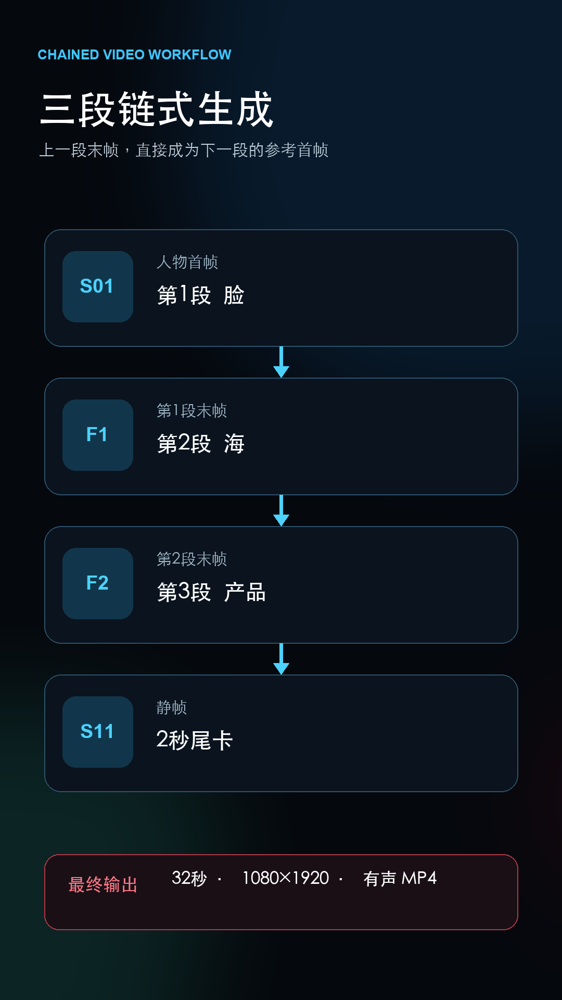

# CUMOB Media Generation for Codex

[中文](README.md) | **English**

> From a creative brief to generated images and videos, inside Codex.

`cumob-media-generation4codex` lets Codex execute image generation, image editing, reference-driven video and generated-audio workflows while handling capability validation, local media uploads, asynchronous polling, task resumption and output saving.

[Read the 32-second case study](docs/cases/tide01-product-promo/README.en.md) · [One-click macOS / Windows installer](https://github.com/66964432/cumob-codex-oneclick-installer/releases/latest) · [Read the installer safety notes](https://github.com/66964432/cumob-codex-oneclick-installer#security)

## Real workflow case

A 32-second Word storyboard was delivered through this workflow:

```text
Read storyboard → obtain user approval → generate technical pilot
→ inspect and retry → chain three generated clips → transcribe dialogue
→ repair timing and audio → export a 32-second MP4
```

This is not a “perfect in one attempt” demonstration. The case includes an unclear hand action, a failed service request and dialogue-timing issues. Codex completed the job by rewriting prompts, recovering tasks, inspecting frames and repairing the final edit.



## Three ways to start

| Goal | Recommended entry point |
| --- | --- |
| Install as quickly as possible | [Download the one-click installer](https://github.com/66964432/cumob-codex-oneclick-installer/releases/latest) |
| Review a reproducible case | [TIDE01 product-promo case](docs/cases/tide01-product-promo/README.en.md) |
| Understand the implementation | Continue with the capabilities, model and CLI documentation below |

A media-generation Skill for Codex that uses the active Codex provider to call
CUMOB-compatible image and video APIs. It supports image generation, editing,
inpainting, restyling, and video generation with models including
`minimax-h3` and `minimax-h3-2k`.

The project includes dependency-free Node.js and Python scripts. They read
Codex's `config.toml` and `auth.json` directly, so API keys do not need to be
placed on the command line.

Current version: `0.6.0`

## Features

- Automatically selects the Images API or Responses API from the provider's
  `image_api` setting.
- Automatically routes image requests to the image script and video requests to
  the CUMOB Videos API script.
- Supports generation, editing, multiple input images, and mask-based
  inpainting.
- Supports size, quality, transparent backgrounds, output formats, and input
  fidelity options.
- Uses the provider, models, endpoint, and authentication already configured
  for Codex.
- Prefers Node.js 18+ and provides Python 3 as a fallback.
- Uses only built-in runtime modules; no `npm install` or `pip install` is
  required.
- Prints long-running progress to stderr while keeping stdout available for
  result summaries.
- Provides `--dry-run` to inspect configuration and request structure without
  exposing API keys or image contents.
- Compresses reference images larger than 4 MB into temporary uploads with a
  maximum dimension of 1536 pixels.
- Uses `async=true` by default for CUMOB image and video tasks, with a fixed
  30-second status polling interval (overridable with `--poll-interval <seconds>`).
  Successful status checks keep that configured interval; server-provided
  `retry_after`/`retryAfter` values take precedence, while transient network
  errors and 408/425/429/5xx responses use independent exponential backoff up to
  60 seconds. Tasks can be resumed without creating a duplicate request.
- Loads video model capabilities from `video-models.json`. `minimax-h3`
  supports 10-15 seconds at fixed 768p and accepts video references;
  `minimax-h3-2k` supports 10-15 seconds at fixed 1440p but does not accept
  video references. CUMOB applies each fixed resolution by default, so the
  request omits `resolution`. Safely adjustable range errors are normalized
  with a notice, while unsupported video references fail before submission.
- Preserves transparent PNG inputs and never modifies originals or mask files.
- Supports synchronous/asynchronous video responses, polling, resume, and MP4
  downloads.
- Uses JSON when all references are URLs, and switches to multipart upload when
  local image, video, or audio references are present.

## Repository Layout

```text
cumob-media-generation4codex/
├── SKILL.md
├── README.md
├── README.en.md
├── LICENSE
├── VERSION
├── video-models.json
├── vendor-skills/
│   ├── registry.json
│   └── minimax/
│       └── MiniMax-H3-main/    # Vendored official directory, unchanged
├── evals/
│   └── evals.json
├── tests/
│   ├── test-video-models.mjs
│   └── test-video-prompts.mjs
└── scripts/
    ├── generate-image.mjs
    ├── generate-image.py
    ├── generate-video.mjs
    ├── generate-video.py
    ├── validate-video-prompt.mjs
    └── validate-video-prompt.py
```

`SKILL.md` contains the instructions loaded by Codex. `video-models.json`
defines video model capabilities. The scripts under `scripts/` provide Node.js
and Python implementations for both media types.
`vendor-skills/` stores unchanged snapshots of official vendor Skills. The
MiniMax H3 directory is kept separate from the project Skill and is not edited
by project scripts. `vendor-skills/registry.json` records each source, path, and
file hash so the snapshot can be updated independently and checked for drift.

### H3 prompt optimization and H3-Context-IR

For video models mapped to an official prompt Skill, Codex first normalizes the
model's effective duration, resolution, and reference limits, then reads the
vendored Skill and uses the model running the current Codex task to write the
final prompt. The default flow does not call the paid MiniMax H3-Context-IR or
any other prompt-model API, and the video scripts never make such a request.

Save structured prompts as UTF-8 text and pass them with `--prompt-file`. The
scripts validate H3 field order, official media labels, timestamps, and model
reference rules, and record prompt provenance and the selected official Skill in
dry-run output, task state, and result summaries. H3-Context-IR is currently
only an explicit external provenance label; a future adapter must be separately
authenticated and opt-in.

## Requirements

Install at least one of the following runtimes:

- Node.js 18 or newer, recommended.
- Python 3.

The scripts support macOS, Linux, and Windows and do not require the OpenAI SDK.

## Installation

### Personal Codex Skill

macOS or Linux:

```bash
mkdir -p "${CODEX_HOME:-$HOME/.codex}/skills"
git clone https://github.com/66964432/cumob-media-generation4codex.git \
  "${CODEX_HOME:-$HOME/.codex}/skills/cumob-media-generation4codex"
```

Windows PowerShell:

```powershell
$codexHome = if ($env:CODEX_HOME) { $env:CODEX_HOME } else { Join-Path $HOME ".codex" }
New-Item -ItemType Directory -Force (Join-Path $codexHome "skills") | Out-Null
git clone https://github.com/66964432/cumob-media-generation4codex.git (Join-Path $codexHome "skills\cumob-media-generation4codex")
```

Restart Codex or start a new Codex task after installation so the Skill list is
reloaded.

### Project-local Skill

To make the Skill available only inside one repository, clone it into that
project's `.codex/skills` directory:

```bash
mkdir -p .codex/skills
git clone https://github.com/66964432/cumob-media-generation4codex.git \
  .codex/skills/cumob-media-generation4codex
```

Project-local Skill availability depends on the current Codex version and
workspace policy. Use the personal Skills directory if Codex does not discover
the project-local installation.

## Configuration

By default, the scripts read:

- `$CODEX_HOME/config.toml` when `CODEX_HOME` is set.
- Otherwise, `~/.codex/config.toml`.
- `auth.json` in the same directory for `OPENAI_API_KEY`.

### CUMOB Images API

Add a provider to the Codex `config.toml`:

```toml
model_provider = "cumob"
model = "your-response-model"

[model_providers.cumob]
name = "CUMOB"
base_url = "https://api.cumob.com/v1"
image_api = "images"
image_model = "gpt-image-2.5"
video_api = "videos"
video_model = "minimax-h3"
```

The scripts call:

- `<base_url>/images/generations`
- `<base_url>/images/edits`
- `<base_url>/videos`
- `<base_url>/status/{id}`

### Responses API

For a provider that supports the Responses API `image_generation` tool:

```toml
model_provider = "openai-compatible"
model = "your-response-model"

[model_providers.openai-compatible]
name = "OpenAI Compatible"
base_url = "https://example.com/v1"
image_api = "responses"
image_model = "gpt-image-1"
```

When `image_api` is not configured, the scripts default to `responses`.

### Environment-variable Fallback

When Codex configuration is unavailable, use:

```bash
export OPENAI_BASE_URL="https://example.com/v1"
export OPENAI_MODEL="your-response-model"
export OPENAI_IMAGE_MODEL="gpt-image-1"
export OPENAI_IMAGE_API="responses"
export OPENAI_VIDEO_MODEL="minimax-h3"
export OPENAI_API_KEY="<your-api-key>"
```

Never place a real API key in the repository, chat messages, command-line
arguments, or Git commits.

## Usage

In normal use, ask Codex for an image:

```text
Generate a 1024x1024 product photo of a black ceramic mug and save it to outputs/mug.png.
```

Codex uses `SKILL.md` to select and run the appropriate script. The CLI can also
be invoked directly.

For a video request, Codex automatically invokes the video script, for example:

```text
Generate a 10-second 16:9 video and save it to outputs/demo.mp4.
```

### Automatic Reference-image Compression

For image edits, the scripts inspect each `--image` file by default. Inputs
larger than 4 MB are prepared as temporary local upload copies:

- The longest side is reduced to `1536px`.
- Ordinary images are converted to JPEG at quality `85`.
- Images with an alpha channel remain PNG.
- Original images and `--mask` files are not modified.
- Temporary files are removed when the command exits.

On macOS, the scripts use the built-in `sips` command. Other platforms try
ImageMagick's `magick` command. When neither optimizer is available, the scripts
continue with the original input instead of failing.

Override the defaults:

```bash
node scripts/generate-image.mjs \
  --prompt "Restyle while preserving composition" \
  --image reference.png \
  --max-input-dimension 1536 \
  --input-jpeg-quality 85 \
  --input-optimize-threshold-mb 4 \
  --out outputs/result.png
```

Upload original input files without preprocessing:

```bash
node scripts/generate-image.mjs \
  --prompt "Use the exact original input bytes" \
  --image reference.png \
  --no-input-optimization \
  --out outputs/result.png
```

### Generate an Image

```bash
node scripts/generate-image.mjs \
  --prompt "A matte black ceramic mug on a walnut desk, soft window light" \
  --out outputs/mug.png \
  --size 1024x1024 \
  --quality high
```

Python fallback:

```bash
python3 scripts/generate-image.py \
  --prompt "A matte black ceramic mug on a walnut desk, soft window light" \
  --out outputs/mug.png \
  --size 1024x1024 \
  --quality high
```

### Transparent Background

```bash
node scripts/generate-image.mjs \
  --prompt "A centered folded paper crane app icon, no text" \
  --out outputs/crane.png \
  --background transparent \
  --format png
```

### Edit an Image

```bash
node scripts/generate-image.mjs \
  --prompt "Restyle as a polished editorial illustration while preserving composition" \
  --image reference.png \
  --action edit \
  --input-fidelity high \
  --out outputs/restyled.png
```

### Inpaint with a Mask

```bash
node scripts/generate-image.mjs \
  --prompt "Replace the masked area with a glass vase of yellow flowers" \
  --image room.png \
  --mask mask.png \
  --action edit \
  --out outputs/inpainted.png
```

### Inspect Resolved Configuration

`--dry-run` does not send an API request:

```bash
node scripts/generate-image.mjs \
  --prompt "Configuration check" \
  --out outputs/test.png \
  --dry-run
```

The output reports whether a key was found and where it came from, but never
prints the key value. Base64 data from input images is also redacted.

Display all CLI options:

```bash
node scripts/generate-image.mjs --help
```

Video example:

```bash
node scripts/generate-video.mjs \
  --prompt "A cat chasing the ball in @图片1" \
  --image reference.png \
  --duration 10 \
  --aspect-ratio 16:9 \
  --out outputs/cat.mp4
```

For a structured prompt written by the current Codex model using the official
H3 Skill, save the final text to a file first:

```bash
node scripts/validate-video-prompt.mjs \
  --prompt-file outputs/cat.prompt.txt \
  --video-model minimax-h3 \
  --prompt-mode I2VA \
  --prompt-source codex-current-model \
  --duration 10 \
  --image-count 1

node scripts/generate-video.mjs \
  --prompt-file outputs/cat.prompt.txt \
  --prompt-mode I2VA \
  --prompt-source codex-current-model \
  --video-model minimax-h3 \
  --image reference.png \
  --duration 10 \
  --out outputs/cat.mp4
```

These commands do not call H3-Context-IR. `codex-current-model` only records
that the current Codex task wrote the final prompt using the official Skill.

Both MiniMax H3 models accept integer durations from 10 through 15, defaulting
to 10. `minimax-h3` is fixed at 768p and accepts up to 9 images, 3 videos,
and 3 audios. `minimax-h3-2k` is fixed at 1440p and accepts up to 9 images
and 3 audios, but no video references. Both enforce a combined limit of 12
references. Fixed resolutions are omitted from API requests but appear as the
effective resolution in `--dry-run` and result summaries.

Legacy model names `minimax-h3-ref`, `minimax-h3-2k-ref`, and
`agnes-video-v2.0-ref` are mapped to the new canonical identifiers so existing
configurations continue to work after upgrading.

The script uses JSON for URL-only references and multipart for local media.
Image, video, and audio references use the top-level `images`, `videos`, and
`audios` API fields; `metadata` is reserved for user-defined task context.
Local video and audio files use `--video` and `--audio`, while URL references
use `--video-url` and `--audio-url`. Both models also expose
`--generate-audio true|false`, `--webhook <url>`, and `--metadata-json <json>`.
The unsupported `negative_prompt`, `hd`, `first_frame`, and `last_frame`
parameters are not exposed by the scripts.

## Troubleshooting

### Codex Does Not Discover the Skill

Confirm that `SKILL.md` exists directly under the installed Skill directory:

```text
~/.codex/skills/cumob-media-generation4codex/SKILL.md
```

Then restart Codex or start a new task.

### API Key Not Found

First check that Codex's `auth.json` contains `OPENAI_API_KEY`. Alternatively,
provide the key through an environment variable or use
`--api-key-env VARIABLE_NAME` to name a different variable.

Do not use `--api-key`. The scripts reject that option to keep secrets out of
shell history.

### The Request Is Taking a Long Time

Image generation can take several minutes. A
`Still waiting for image result` message means the original command is still
waiting normally. Do not start a duplicate request while it is running.

If an image or video process is interrupted, resume polling with the task ID printed by
the API:

```bash
node scripts/generate-video.mjs \
  --resume task_xxx \
  --out outputs/resumed.mp4
```

The video status endpoint is `<base_url>/status/{id}`. Once the task succeeds,
the script downloads `data[].video_url`.

The script stores the task ID and latest status next to the output as
`<output>.task.json`. Successful status checks use the configured fixed interval
(30 seconds by default) rather than increasing after each check. Server-provided
`retry_after`/`retryAfter` values take precedence; temporary polling disconnects
are retried with independent exponential backoff up to 60 seconds, and the task
is never recreated. Images API requests include `async=true` and support the
same `--resume` flow.

### Incorrect Backend Path

Run `--dry-run` and inspect:

- `image_api`
- `base_url`
- `endpoint`
- `image_model`
- `response_model`

## Development and Validation

Syntax checks:

```bash
node --check scripts/generate-image.mjs
node --check scripts/generate-video.mjs
node tests/test-video-models.mjs
PYTHONPYCACHEPREFIX=/tmp/cumob-image-pycache \
  python3 -m py_compile scripts/generate-image.py
PYTHONPYCACHEPREFIX=/tmp/cumob-video-pycache \
  python3 -m py_compile scripts/generate-video.py
```

Inspect an Images API request offline:

```bash
node scripts/generate-image.mjs \
  --prompt "test" \
  --image-api images \
  --image-model gpt-image-2.5 \
  --dry-run
```

Inspect a Responses API request offline:

```bash
node scripts/generate-image.mjs \
  --prompt "test" \
  --image-api responses \
  --response-model test-response-model \
  --image-model test-image-model \
  --dry-run
```

`evals/evals.json` contains basic agent-behavior evaluation scenarios.

## Versioning

The project follows semantic versioning:

- `MAJOR`: incompatible CLI, configuration, or output-contract changes.
- `MINOR`: backward-compatible features or backend capabilities.
- `PATCH`: backward-compatible fixes and documentation changes.

The current version is stored in the root `VERSION` file. Git tags use a `v`
prefix, for example `v0.3.1`.

## Publishing to GitHub

For a directory that has not been initialized as a Git repository:

```bash
git init
git add .
git commit -m "Initial release v0.2.0"
git branch -M main
```

Create and push a public repository with GitHub CLI:

```bash
gh repo create cumob-media-generation4codex \
  --public \
  --source=. \
  --remote=origin \
  --push
```

Or add this repository as the remote:

```bash
git remote add origin git@github.com:66964432/cumob-media-generation4codex.git
git push -u origin main
```

Create a release tag:

```bash
git tag -a v0.2.0 -m "v0.2.0"
git push origin v0.2.0
```

Then create a GitHub Release from the corresponding tag.

### Subsequent Releases

1. Update the root `VERSION` file.
2. Check that `SKILL.md`, both README files, and the CLI options agree.
3. Run syntax checks and `--dry-run` validation.
4. Commit the version changes.
5. Create and push the corresponding `vX.Y.Z` tag.
6. Create a GitHub Release describing features, fixes, and compatibility
   changes.

Do not move, flatten, or rename `SKILL.md` or `scripts/` in release archives.
Changing that layout can prevent the installed Skill from working.

## Security

- Never commit `.env`, `auth.json`, or a real API key.
- Never expose an Authorization header in issues, logs, or screenshots.
- Prefer `--dry-run` when debugging configuration.
- Check Git history for secrets before publishing.

## License

Licensed under the [Apache License 2.0](LICENSE).
